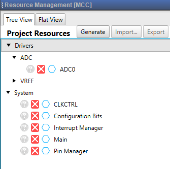
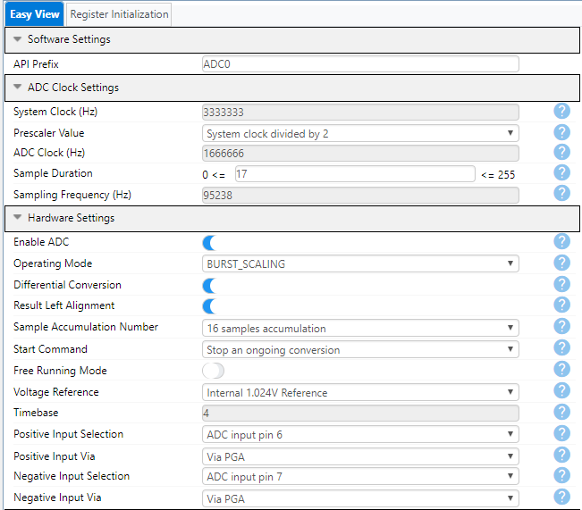
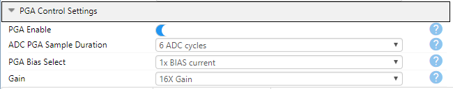

<!-- Please do not change this logo with link -->

# How to Use the 12-Bit Differential ADC with PGA in Burst Accumulation Scaling Mode

This MPLAB® X Melody project shows how to achieve 16-bit resolution using a 12-bit ADC. This is achieved through differential measurements using the Burst Accumulation with Scaling mode, the PGA with 16x gain, and oversampling. The 12-bit differential ADC with PGA is featured in the ATtiny1627 microcontroller.

The example presented here is based on the technical brief [TB3254 - How to Use the 12-Bit Differential ADC with PGA in Burst Accumulation Mode](https://www.microchip.com/wwwappnotes/appnotes.aspx?appnote=en1003019)

## Related Documentation
* [TB3254 - How to Use the 12-Bit Differential ADC with PGA in Burst Accumulation Mode](https://www.microchip.com/wwwappnotes/appnotes.aspx?appnote=en1003019)
* [ATtiny1627 device page](https://www.microchip.com/wwwproducts/en/ATTINY1627)

## Software Used
* [MPLAB® X IDE](http://www.microchip.com/mplab/mplab-x-ide) **5.45** or newer 
* [MPLAB® XC8](http://www.microchip.com/mplab/compilers) **2.31** or a newer compiler 
* [MPLAB® Code Configurator (MCC)](https://www.microchip.com/mplab/mplab-code-configurator) **4.1.0** or newer 
* [MPLAB® Melody Library](https://www.microchip.com/mplab/mplab-code-configurator) **1.37.13** or newer 
* ATtiny **2.6.122** or newer Device Pack

## Hardware Used
* [Microchip ATtiny1627 Curiosity Nano Evaluation Kit](https://www.microchip.com/developmenttools/ProductDetails/DM080104)

## Peripherals Configuration using MCC
### Added Peripherals

### Analog to Digital Converter

## Setup
* Connect signals to PA6 and PA7
  * Positive ADC input: AIN6 -> PA6
  * Negative ADC input: AIN7 -> PA7
* The difference between the signals must range between 0V and 64 mV, and the signals must range between GND and VDD
* To see the 16-bit result, place a breakpoint in the while(1) loop in the main() function and use a debugger to start a debug session. When the device is halted, the variables that are interesting may be placed in the watch list to see their values. 
* If measuring across a 5 ohm resistor, the second to last line in the main() function can be uncommented to measure the current through the resistor. This is further explained in the [technical brief](https://www.microchip.com/wwwappnotes/appnotes.aspx?appnote=en1003019).

## Operation
* Connect the ATtiny1627 Curiosity Nano to a computer using the USB cable
* Download the zip file or clone the example to get the source code
* Open the .X file with the MPLAB® X IDE
* Program the project to the board: right click on the project and click *Make and Program Device*. 

## Conclusion
This example has shown how to achieve a 16-bit resolution for a 12-bit ADC, by using the ATtiny1627 12-bit differential ADC with PGA in Burst Accumulation Mode.